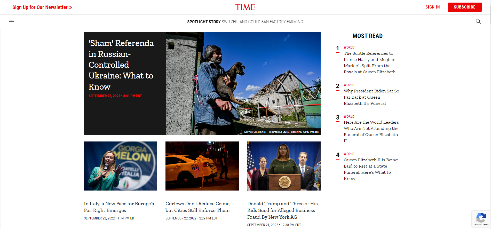
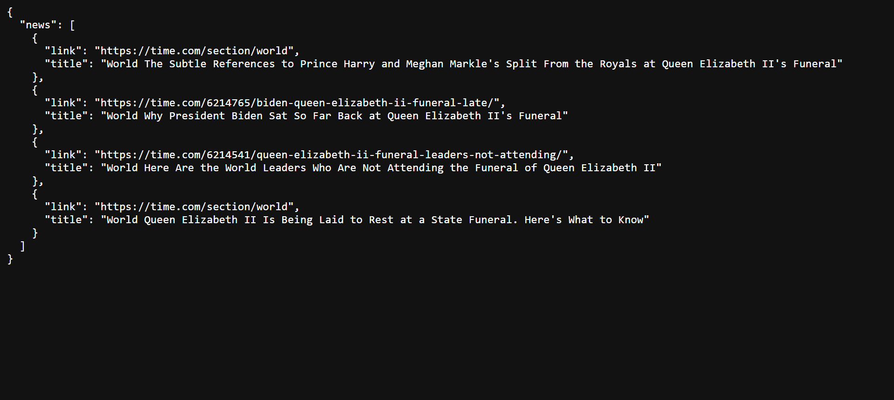

# time-news-scraper

This application is a rest api, written in flask to get the list of most read time articles.

To run the application, run the following command:

1. Create a **virtual environment**
2. `pip install -r requirements.txt`
3. `python api.py`
4. Open  <http://127.0.0.1:5000/getTimeMostRead>

## Demo

- Time page: <https://time.com/>

- Api response: <http://127.0.0.1:5000/getTimeMostRead>

